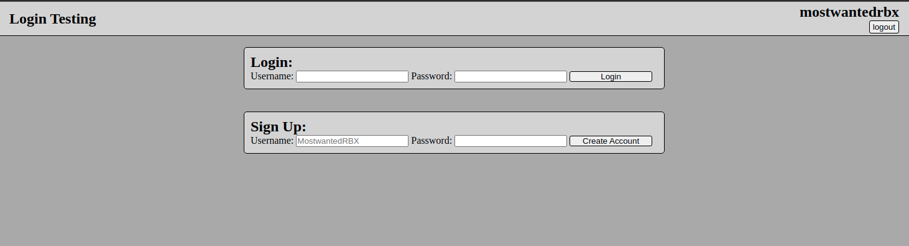

Testing login hashing and comparing using bcrypt and sqlite3... please don't use real passwords if you do try this publicly for some reason.

Currently it has a way to sign up, login, a way to track sessions with tokens, and a way to log out.

Your username is displayed in the top right when you are logged in.

Hurray for old style websites!
